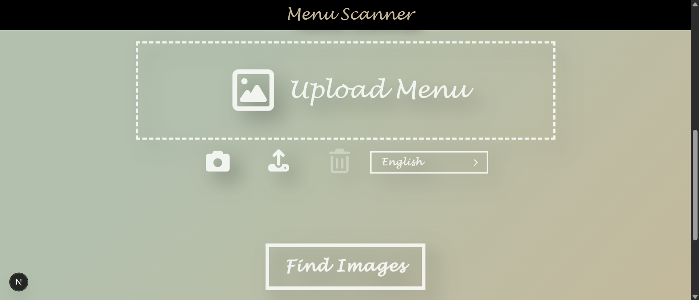
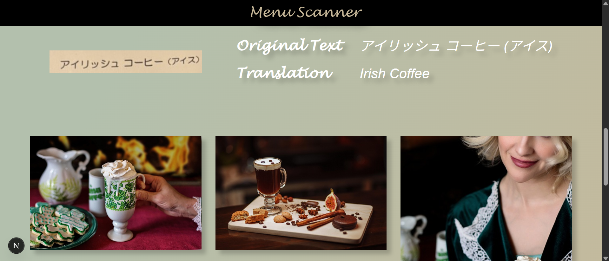
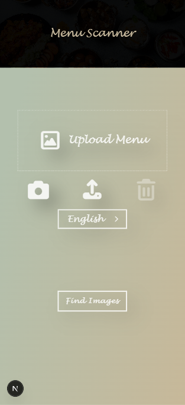
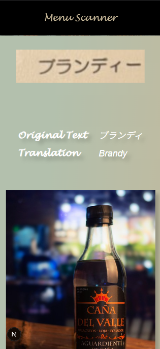

# Menu Scanner

Menu Scanner is a two-part application (FastAPI backend + Next.js frontend) that extracts text from restaurant menus, translates it to English, and returns relevant dish images using the Pixabay API. The goal is to help travelers quickly understand foreign-language menus by simply snapping or uploading a photo.

## Demo
### Desktop
<div align="center">
  
  
  <video src="./assets/menu_scanner_video_1.mp4" width="80%" controls>
</div>

### Mobile
<div align="center">
  
  
</div>


## Features
- Capture or upload menu photos directly from the browser (desktop or mobile).
- Crop images before submission for cleaner OCR results.
- Support for 15+ source languages powered by EasyOCR.
- Automatic translation to English via LibreTranslate.
- Dish image suggestions sourced from Pixabay search results.
- Animated, responsive UI built with Next.js 13 App Router and Tailwind-style utility classes.
- FastAPI backend with typed responses, validation, and CORS configuration for local or hosted deployments.
- Automated backend test suite using pytest.

## Architecture
- **Frontend (`frontend/`)**: Next.js + TypeScript single-page interface. Key components include `PhotoButtonWrapper` (camera/upload/delete actions), `LanguageDropdown`, `SubmitButton`, `MenuImage`, and `DishImages`. API calls are centralized in `src/api/menu.ts`.
- **Backend (`backend/`)**: FastAPI app exposing `/upload-image`. Core services:
  - `TextExtractor` (EasyOCR) for multilingual OCR.
  - `Translator` (LibreTranslate REST API) for English translations.
  - `PixabayAPI` for dish imagery.
  - `MenuScanner` orchestrates the pipeline and returns a `MenuScanResponse`.
- **Data flow**: Frontend form → `uploadImage` fetch → FastAPI → OCR → translation → Pixabay lookup → JSON response rendered in UI.

## Requirements
- Node.js 20+ and npm (or pnpm/yarn) for the frontend.
- Python 3.11+ and pip for the backend.
- Optional: `uv` or `pipenv` if you prefer, but instructions assume `python -m venv`.
- API keys (see below) for translations and images.

## Environment Variables

| Location | Variable | Description |
| --- | --- | --- |
| Backend | `LIBRETRANSLATE_API_KEY` | API key for [LibreTranslate](https://libretranslate.com/). Required for production; optional when using the public rate-limited instance. |
| Backend | `PIXABAY_API_KEY` | API key from [Pixabay](https://pixabay.com/api/docs/). Required for dish imagery. |
| Backend | `FRONTEND_URL` | Origin allowed by CORS (defaults to `https://menu-scanner-eight.vercel.app`). Override for local dev. |
| Frontend | `NEXT_PUBLIC_BACKEND_URL` | Base URL of the FastAPI server (e.g., `http://localhost:8000`). Must be prefixed with `NEXT_PUBLIC_` to be exposed client-side. |

Create `.env` files in both `backend/` and `frontend/` directories as needed.

## Local Development

### Backend
```powershell
cd backend
python -m venv .venv
.venv\Scripts\activate  # Linux/macOS: source .venv/bin/activate
pip install --upgrade pip
pip install -r requirements.txt
python -m uvicorn src.main:app --reload --host 0.0.0.0 --port 8000
```

The server exposes:
- `POST /upload-image`: multipart form with `source_language` and image file. Returns `{ extracted_text, translated_text, image_urls }`.
- `OPTIONS /upload-image`: automatic CORS preflight handler.
- `POST /test`: simple health check for debugging CORS/connectivity.

### Frontend
```bash
cd frontend
npm install
cp .env.example .env.local  # if present; otherwise create manually
npm run dev
```

Set `NEXT_PUBLIC_BACKEND_URL=http://localhost:8000` (or your deployed backend) in `.env.local`. The app runs at `http://localhost:3000`.

## Testing
- **Backend**: `cd backend && .venv\Scripts\activate && pytest`
- **Frontend**: Add unit/component tests as needed. (None are included yet.)

## Deployment
- **Backend**: Deploy the FastAPI app to services like Azure App Service, Render, Railway, or Docker/Kubernetes. Ensure environment variables and OCR dependencies (EasyOCR + PyTorch) are installed.
- **Frontend**: Deploy the Next.js app to Vercel, Netlify, or any Node-friendly platform. Remember to set `NEXT_PUBLIC_BACKEND_URL` to the public backend URL.
- Configure HTTPS on both ends and update `FRONTEND_URL` to match the deployed frontend origin.

## Troubleshooting
- **`uvicorn` launcher errors**: Ensure you activate the correct virtual environment (`backend\.venv`) before running `uvicorn`. Reinstall with `python -m pip install --upgrade uvicorn` if scripts reference a deleted venv.
- **OCR timeout**: EasyOCR can take up to ~2 minutes on first run. The frontend aborts after 120 seconds; retry once the model cache is warm.
- **CORS failures**: Double-check `FRONTEND_URL` and `NEXT_PUBLIC_BACKEND_URL`. The backend allows localhost:3000 plus the configured origin.
- **Blank translations or images**: Verify both API keys and inspect server logs for request/response errors.

## License

This project is distributed under the terms of the MIT License. See `LICENSE` for details.